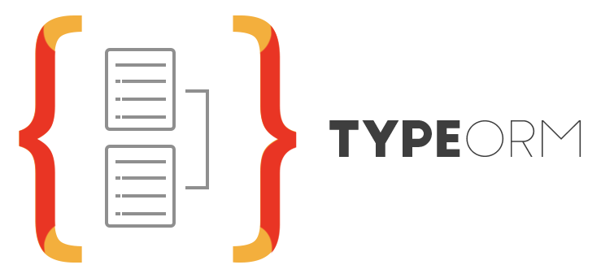
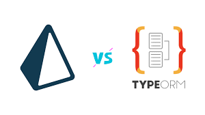
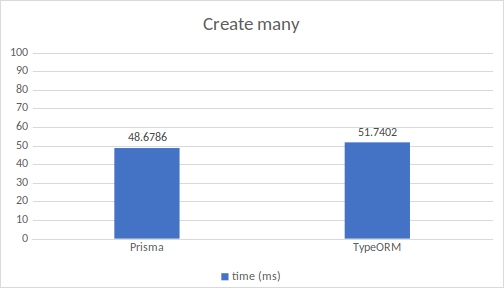
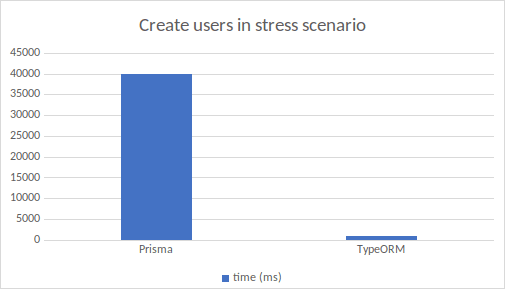
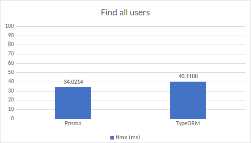

**Виконав:**
*Студент 2-го курсу, групи ІМ-21:*

<span padding-right:5em></span> **Скиба Марат** [Пошта: marat.skyba@gmail.com, [Телеграм](https://t.me/siniggami)]

**Керівник**

*доцент кафедри ОТ ФІОТ, к.т.н., доцент*<span padding-right:5em></span> **Андрій БОЛДАК**

[НТУУ "КИЇВСЬКИЙ ПОЛІТЕХНІЧНИЙ ІНСТИТУТ імені ІГОРЯ СІКОРСЬКОГО](https://kpi.ua/)

[Факультет інформатики та обчислювальної техніки](https://fiot.kpi.ua/)

[Кафедра обчислювальної техніки](https://comsys.kpi.ua/)

Київ

# TypeOrm
<p align="center">
  
</p>

## Що таке TypeOrm?
TypeORM - це Object-Relational Mapping (ORM) бібліотека для TypeScript та JavaScript,
яка дозволяє розробникам взаємодіяти з реляційними базами даних, використовуючи 
об'єктно-орієнтований підхід. Основна ідея ORM полягає в тому, щоб забезпечити 
можливість взаємодії з базою даних за допомогою об'єктів і класів, замість написання 
SQL-запитів безпосередньо.

TypeORM підтримує різні системи управління базами даних (СУБД), такі як MySQL, 
PostgreSQL, SQLite, та інші. Він надає можливості створення, оновлення, видалення 
та вибірки даних, використовуючи зручний синтаксис TypeScript або JavaScript.

Додатково, TypeORM дозволяє визначати сутності (entity), які відображають таблиці 
в базі даних, та використовувати різні декоратори для налаштування взаємозв'язків
між сутностями. Це робить роботу з базою даних більш абстрактною і зручною для розробників.

## Сутності
У TypeORM, сутність (entity) є концепцією, яка відображає об'єкт або клас в програмному 
коді на таблицю в базі даних. Кожен екземпляр сутності представляє запис в цій 
таблиці. Основна ідея полягає в тому, щоб мати можливість працювати з даними в базі даних,
використовуючи об'єктно-орієнтований підхід.

```ts
import { Entity, PrimaryGeneratedColumn, Column } from "typeorm"

@Entity()
export class User {
@PrimaryGeneratedColumn()
id: number

    @Column()
    firstName: string

    @Column()
    lastName: string

    @Column()
    isActive: boolean
}
```

Загалом, сутності в TypeORM роблять взаємодію з базою даних більш зручною і абстрактною, 
дозволяючи використовувати об'єктно-орієнтований підхід при роботі з даними.


## Відношення між сутностями
В TypeORM відношення між сутностями визначають, як одна сутність пов'язана з іншою в
контексті бази даних. Це може бути один до одного (One-to-One), один до багатьох (One-to-Many),
багато до одного (Many-to-One) або багато до багатьох (Many-to-Many) відношення. 
Додавання відношень робить модель бази даних більш гнучкою і можливою для відображення 
реальних взаємозв'язків між сутностями.

### One-to-one
One-to-one - це відношення, в якому A містить лише один екземпляр B, і B містить лише один 
екземпляр A. Давайте, наприклад, розглянемо сутності User та Profile. У користувача може 
бути лише один профіль, і лише один профіль належить лише одному користувачеві.

```ts
import { Entity, PrimaryGeneratedColumn, Column } from "typeorm"

@Entity()
export class Profile {
    @PrimaryGeneratedColumn()
    id: number

    @Column()
    gender: string

    @Column()
    photo: string
}
```

```ts
import {
    Entity,
    PrimaryGeneratedColumn,
    Column,
    OneToOne,
    JoinColumn,
} from "typeorm"
import { Profile } from "./Profile"

@Entity()
export class User {
    @PrimaryGeneratedColumn()
    id: number

    @Column()
    name: string

    @OneToOne(() => Profile)
    @JoinColumn()
    profile: Profile
}
```

Тут ми додали анотацію @OneToOne до користувача і вказали тип цільового відношення - Profile. 
Ми також додали анотацію @JoinColumn, яка є обов'язковою і повинна бути встановлена лише на одному
боці відношення. Той бік, на якому вствноілюється @JoinColumn, буде містити ідентифікатор відношення (relation id)
та зовнішні ключі (foreign keys) до таблиці цільової сутності.

### Many-to-one / one-to-many
Many-to-one / one-to-many - це відношення, де A містить кілька екземплярів B, але B містить лише один екземпляр A.
Давайте, наприклад, розглянемо сутності User та Photo. У користувача може бути кілька фотографій, 
але кожна фотографія належить лише одному користувачеві.

```ts
import { Entity, PrimaryGeneratedColumn, Column, ManyToOne } from "typeorm"
import { User } from "./User"

@Entity()
export class Photo {
    @PrimaryGeneratedColumn()
    id: number

    @Column()
    url: string

    @ManyToOne(() => User, (user) => user.photos)
    user: User
}
```

```ts
import { Entity, PrimaryGeneratedColumn, Column, OneToMany } from "typeorm"
import { Photo } from "./Photo"

@Entity()
export class User {
    @PrimaryGeneratedColumn()
    id: number

    @Column()
    name: string

    @OneToMany(() => Photo, (photo) => photo.user)
    photos: Photo[]
}
```

Тут ми додали анотацію @OneToMany до поля photos та вказали тип цільового відношення - Photo. 
Також, можна опустити анотацію @JoinColumn в відношенні @ManyToOne / @OneToMany. @OneToMany не може 
існувати без @ManyToOne. Якщо ви хочете використовувати @OneToMany, @ManyToOne обов'язковий. Однак
обернене відношення не обов'язкове: якщо вас цікавить лише відношення @ManyToOne, ви можете визначити
його без @OneToMany в пов'язаній сутності. Там, де ви встановите @ManyToOne, пов'язана сутність матиме
ідентифікатор відношення (relation id) та зовнішній ключ (foreign key).

### Many-to-many
Many-to-many - це відношення, де A містить кілька екземплярів B, і B містить кілька екземплярів A.
Давайте, наприклад, розглянемо сутності Question та Category. Питання може мати кілька категорій, 
і кожна категорія може мати кілька питань.

```ts
import { Entity, PrimaryGeneratedColumn, Column } from "typeorm"

@Entity()
export class Category {
@PrimaryGeneratedColumn()
id: number

    @Column()
    name: string
}
```

```ts
import {
  Entity,
  PrimaryGeneratedColumn,
  Column,
  ManyToMany,
  JoinTable,
} from "typeorm"
import { Category } from "./Category"

@Entity()
export class Question {
  @PrimaryGeneratedColumn()
  id: number

  @Column()
  title: string

  @Column()
  text: string

  @ManyToMany(() => Category)
  @JoinTable()
  categories: Category[]
}
```

@JoinTable() обов'язковий для відношень @ManyToMany. Необхідно встановлювати @JoinTable на одному 
(власному) боці відношення.

## Що таке DataSource?
Взаємодія з базою даних можлива лише після налаштування DataSource. DataSource в TypeORM містить
параметри підключення до бази даних і встановлює початкове з'єднання з базою даних або пул з'єднань в 
залежності від СКБД, яка використовується.

Для встановлення початкового з'єднання або пулу з'єднань необхідно викликати метод initialize 
екземпляра DataSource.

Зазвичай метод initialize екземпляра DataSource викликається при завантаженні, а після завершення
роботи з базою даних він знищується. У практиці, якщо будується бекенд для сайту і сервер бекенду
завжди залишається в роботі, DataSource ніколи не знищується.

```ts
import { DataSource } from "typeorm"

const AppDataSource = new DataSource({
  type: "mysql",
  host: "localhost",
  port: 3306,
  username: "test",
  password: "test",
  database: "test",
})

AppDataSource.initialize()
  .then(() => {
    console.log("Data Source has been initialized!")
  })
  .catch((err) => {
    console.error("Error during Data Source initialization", err)
  })
```


# TypeOrm vs Prisma
<p align="center">
  
</p>

При виборі ORM (Object-Relational Mapping) для Node.js розробки, два популярних варіанти, 
які варто розглянути, - це TypeORM та Prisma. Обидва фреймворки пропонують зручний спосіб
взаємодії з базами даних, проте вони мають свої особливості та переваги.

## TypeORM
### Опис:
TypeORM - це ORM-фреймворк для TypeScript та JavaScript, який дозволяє легко взаємодіяти
з реляційними базами даних. Він підтримує багато різних баз даних, таких як MySQL, PostgreSQL, SQLite та інші.

### Переваги:
Гнучкість: TypeORM дозволяє працювати як з схемою бази даних, так і з сутностями, що робить його гнучким та зручним для
роботи з різними структурами баз даних.

Широкий вибір баз даних: Підтримка різноманітних баз даних дозволяє вибрати найбільш підходящий сховище даних для проекту.

### Недоліки:
Швидкість: Деякі відгуки вказують на меншу швидкість TypeORM порівняно з іншими ORM-фреймворками.


## Prisma
### Опис:

Prisma - це інноваційний і молодий інструмент, який поєднує в собі функціональність ORM і бази даних. 
Забезпечуючи підтримку для TypeScript та JavaScript, Prisma створений для того, щоб полегшити взаємодію 
з базами даних у сучасних Node.js додатках.

### Переваги:
Типізація: Prisma використовує сильну типізацію, що дозволяє виявляти помилки на етапі компіляції, забезпечуючи безпеку типів.

Зручність: Моделі в Prisma легко визначати та маніпулювати, а автоматичне виведення SQL-запитів полегшує роботу з базою даних.

### Недоліки:
Підтримка баз даних: Хоча Prisma вражає роботою з PostgreSQL, MySQL та SQLite, його підтримка інших баз даних може бути обмеженою.

# Порівняння часових характеристик
<p align="center">
  
</p>

TypeORM та Prisma практично володіли однаковою продуктивністю у випадках "Create Many", 
з невеликою перевагою на користь Prisma у вигляді трошки швидшої роботи.

<p align="center">
  
</p>

TypeORM показав значно кращу продуктивність при створенні нових записів у стресовому сценарії 
(багато записів за секунду). Однак ця інформація може бути застарілою, з огляду на останні 
оновлення Prisma до версії 5.1.0.

<p align="center">
  
</p>

TypeORM та Prisma практично володіли однаковою продуктивністю у випадках "Find all", 
із невеликою перевагою на користь Prisma у вигляді трошки швидшої роботи.

<p align="center">
  
</p>

TypeORM та Prisma практично володіли однаковою продуктивністю у випадках "Find by a given condition",
показуючи схожі результати.

# Порівняння та висновки
Обидва фреймворки мають свої переваги та недоліки, і вибір між ними залежить від конкретних потреб проекту. 
TypeORM може бути кращим вибором для проектів, де необхідна велика гнучкість та підтримка різних баз даних. 
З іншого боку, Prisma може вражати своєю типізацією та зручністю роботи з базою даних.


